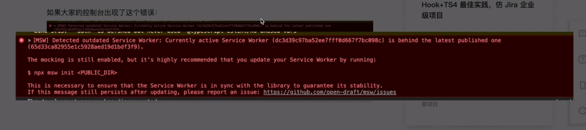

# Getting Started with Create React App

This project was bootstrapped with [Create React App](https://github.com/facebook/create-react-app).

## Available Scripts

In the project directory, you can run:

### `yarn start`

Runs the app in the development mode.\
Open [http://localhost:3000](http://localhost:3000) to view it in the browser.

The page will reload if you make edits.\
You will also see any lint errors in the console.

### `yarn test`

Launches the test runner in the interactive watch mode.\
See the section about [running tests](https://facebook.github.io/create-react-app/docs/running-tests) for more information.

### `yarn build`

Builds the app for production to the `build` folder.\
It correctly bundles React in production mode and optimizes the build for the best performance.

The build is minified and the filenames include the hashes.\
Your app is ready to be deployed!

See the section about [deployment](https://facebook.github.io/create-react-app/docs/deployment) for more information.

### `yarn eject`

**Note: this is a one-way operation. Once you `eject`, you can’t go back!**

If you aren’t satisfied with the build tool and configuration choices, you can `eject` at any time. This command will remove the single build dependency from your project.

Instead, it will copy all the configuration files and the transitive dependencies (webpack, Babel, ESLint, etc) right into your project so you have full control over them. All of the commands except `eject` will still work, but they will point to the copied scripts so you can tweak them. At this point you’re on your own.

You don’t have to ever use `eject`. The curated feature set is suitable for small and middle deployments, and you shouldn’t feel obligated to use this feature. However we understand that this tool wouldn’t be useful if you couldn’t customize it when you are ready for it.

## Learn More

You can learn more in the [Create React App documentation](https://facebook.github.io/create-react-app/docs/getting-started).

To learn React, check out the [React documentation](https://reactjs.org/).

/public/manifest.json pwa
/public/robots.txt 搜索引擎相关

# 配置 prettier

1. yarn add prettier --save
2. 添加.prettierignore .prettierrc.json 手动添加 因为用 echo 的方式创建的文件默认是 utf-16 的，可能会与编辑器的字符串冲突导致报错
   vscode 编辑器可能需要重新设置字符集
3. npx mrm@2 lint-staged package.json 文件会自动有变化
4. yarn add eslint-config-prettier -D 忽略 prettier 和 eslint 的影响 配置请参照 package.json

以上完成之后 当你提交代码时会自动格式化（prettier）代码 webstorm 设置->prettier->ctrl+alt_l(格式化代码)时运行 prettier

type:

- feat：新功能（feature）
- fix：修补 bug
- docs：文档（documentation）
- style： 格式（不影响代码运行的变动）
- refactor：重构（即不是新增功能，也不是修改 bug 的代码变动）
- test：增加测试
- chore：构建过程或辅助工具的变动
- upgrade： 第三方库升级
- revert：回滚

# 问题

- React Hook "useDebounce" cannot be called inside a callback. React Hooks must be called in a React function component or a custom React Hook function
-  如果出现此错误，请运行 npx msw init public
- 引入 svg 后在项目中以 svg 的形式显示 而不是 img 标签形式展示 import {ReactComponent as SoftwareLogo} from 'assets/software-logo.svg'; 参照 src/authenticatedApp 中引入方式
- react-query
- 单页应用中使用 url（配合 react-router 中的 useSearchParams） 进行状态管理 场景：页面进行了搜索 复制这个链接发给别人 别人打开之后就是搜索好的内容
- 查找页面为啥会重复渲染 库：why-did-you-render

# json-server 配置自定义请求

在**json.server_mock**文件下添加 middleware.js 文件 package.json 中修改 json-server 的参数

# service-worker

[使用方法](https://www.npmjs.com/package/jira-dev-tool)
使用该方式后即可删除掉 json-server 相关内容 **json_server_mock**文件夹 package.json 文件中相关内容，
为了以后使用，这里保留

# unauthenticated-app

非登录状态下的展示

当请求出错时 fetchAPI 并不会给我们自动抛出异常 在封装的时候请手动抛出异常 fetch().catch(() => console.log('并不会接收到异常'))

# antd

下载之后请在项目入口文件（index.tsx）文件中引入相关 less 文件 为什么要引入 less 文件 因为要根据 less 文件修改 antd 的主题色
自定义主题需要用到[craco](https://www.npmjs.com/package/@craco/craco)这个库 在 create-react-app 中自定义主题文件配置请[参考](https://ant.design/docs/react/use-with-create-react-app-cn)

# typescript

在编写类声明文件（.d.ts）时，declare 表示声明作用
as const
